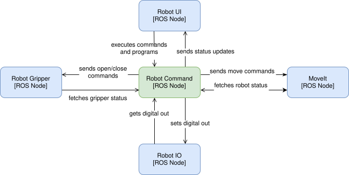
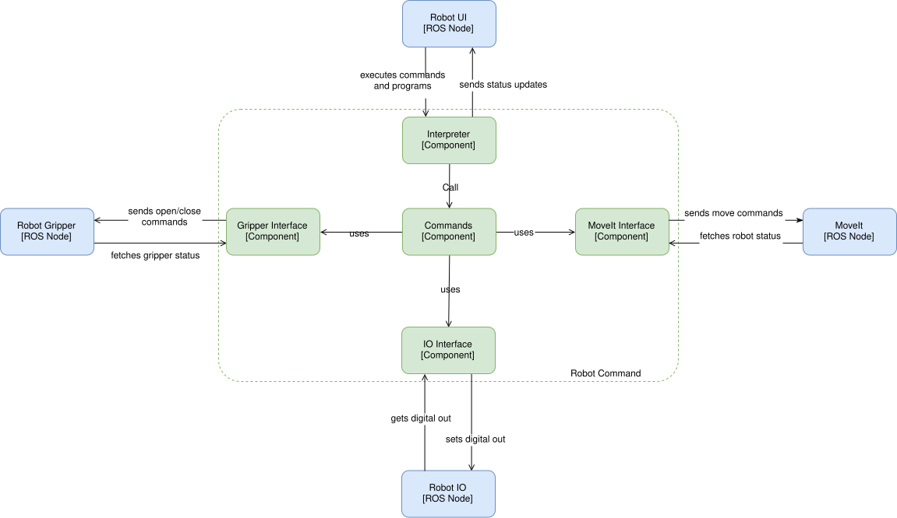

:source-highlighter: pygments
:sectnums:

= RPL Implementation
:revnumber: v0.01
:toc:
:sectnumlevels: 5
:toclevels: 5

Test Foo Bar Baz

.TMC Script - Container Diagram

.TMC Script - Component Diagram

