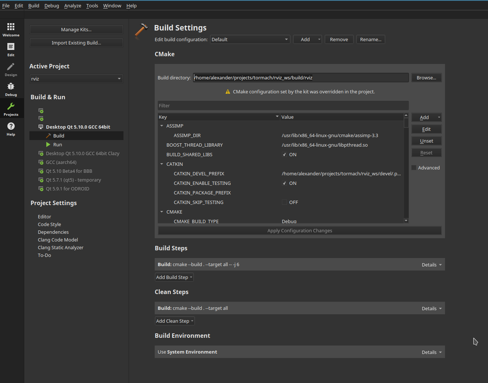

# PathPilot Robot UI

This package contains the PathPilot Robot UI.

## Source directory structure

```
.
├── fonts              - contains the GUI fonts
├── icons              - contains the GUI icons
├── pathpilot          - module folder for both Python and QML source code
│   ├── base             - rarely imported components that can't live in core
│   ├── controls         - GUI controls
│   ├── core             - core components and singletons
│   ├── development      - components used for development purposes
│   ├── file             - anything file IO related
│   ├── handlers         - state handler components
│   ├── models           - models exposed to QML
│   ├── panels           - contains the GUI split up by context
│   ├── program          - contains everything related to the robot program
│   ├── robot            - contains anything robot/ros related
│   └── screens          - the GUI screens such as the main screen
├── prototyping        - components used during GUI prototyping with live mode
├── scripts            - development scripts which operate on icons, fonts, ...
└── translations       - contains Qt translation files
```

## Launching the UI Test Setup

The GUI application can be started with:
```bash
roslaunch robot_ui app.launch
```

If you want to run the `robot_ui` in addition to an existing
MoveIt setup use:

```bash
roslaunch robot_ui moveit.launch
```

## Live Coding

The Robot UI supports a live coding. You can start the live coding environment with:
```bash
roslaunch robot_ui live-coding.launch
```

If you want to run the `robot_ui` with live coding enabled in addition to an exisiting
MoveIt setup use:
```bash
roslaunch robot_ui moveit.launch live_coding:=true
```

Live coding only works for QML code. For the Python modules and singleton QML items you need to restart the live coding app, which can be done by pressing the "Restart" button.

Live coding has some limitations for singleton QML components. If you work with singletons components please make sure to restart the app after making the changes.

## Working with Robot Programs

The robot program home folder is per default set to `~/nc_files/robot_programs/` and can be customized in `Config.qml`.
You can find some example programs in the `robot_command` package `example` folder.

Additionally, you need to start the `robot_command` node as described in the [README](../robot_command/README.md).

## Quickstart with the Development Scripts

To avoid typing the roslaunch commands every time you want to start the `robot_ui` you can alternatively use the [development_scripts](../../devel_scripts/README.md).

```bash
python devel_scripts/start_moveit_config.py
python devel_scripts/start_robot_ui.py
```

The second comamnd also starts the `robot_command` node.

### Using Qt Creator for Compiling ROS Projects

Make sure to start Qt Creator form your ROS development terminal and not your system environment, else you'll end up messing up your CMake build.

Also, make sure to do one `catkin build` before attempting to build the project with Qt Creator, else you'll get all sorts of errors.

Moreover, if you want to enable debugging from Qt Creator you need to configure your catkin build for debugging with the following command:

```
catkin config --cmake-args -DCMAKE_BUILD_TYPE=Debug
catkin clean
catkin build
```

Next, open the top-level CMakeLists.txt of your project in Qt Creator. Qt Creator will attempt to parse the CMake file, but it will fail.

To make the CMake build work you need to set the correct build directory in the build settings of your project. Once that is completed you should be able to build the C++ application.



### Known Problems

* None that will not be fixed.
